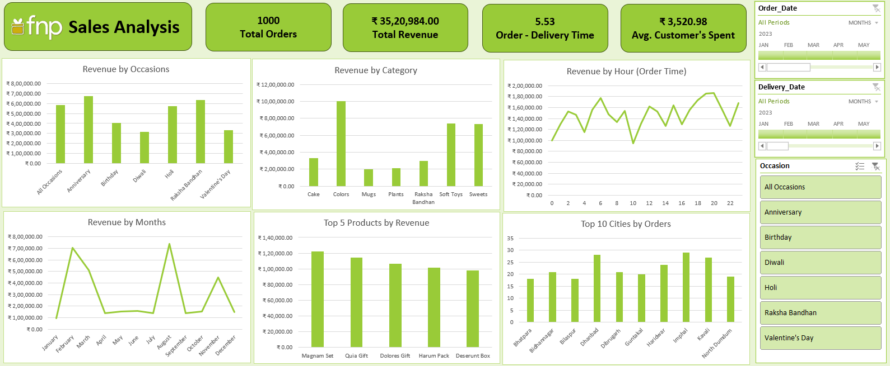

# 🎁 FNP Sales Analysis Dashboard

## 📌 Project Overview

The **FNP Sales Analysis Dashboard** is an interactive Excel dashboard developed to analyze sales data from **Ferns N Petals (FNP)** — a gifting company specializing in products for occasions like 🎂 Birthdays, ❤️ Valentine’s Day, 🪔 Diwali, 🎉 Anniversaries, and more.

This project focuses on transforming raw sales data into meaningful business insights using **Microsoft Excel**.

---

# 🧩 Problem Statement

FNP wanted to analyze its sales performance, customer behavior, product demand, and delivery efficiency to improve business decision-making.

The dashboard answers the following business questions:

* 📈 What is the total revenue generated?
* 🚚 What is the average order-to-delivery time?
* 📅 How do sales perform across different months?
* 🏆 Which products generate the highest revenue?
* 💰 How much do customers spend on average?
* 🌆 Which cities place the most orders?
* 🎊 Which occasions generate the most revenue?
* 🎁 Which products are most popular during specific occasions?

---

# 📊 Dashboard Preview

---

# 🚀 Key Features

## ✅ KPI Cards

* 📦 Total Orders
* 💵 Total Revenue
* 🚚 Average Delivery Time
* 👤 Average Customer Spending

---

## 📉 Charts & Visualizations

### 🎊 Revenue by Occasions

Analyze revenue generated during:

* Anniversary
* Birthday
* Diwali
* Holi
* Raksha Bandhan
* Valentine’s Day

### 🛍️ Revenue by Category

Track category-wise sales performance:

* Cakes
* Colors
* Mugs
* Plants
* Soft Toys
* Sweets

### ⏰ Revenue by Hour

Understand customer ordering behavior throughout the day.

### 📅 Revenue by Months

Identify seasonal sales trends and monthly performance.

### 🏆 Top 5 Products by Revenue

Discover the highest revenue-generating products.

### 🌆 Top 10 Cities by Orders

Find cities with the highest order volume.

---

# 🎛️ Interactive Features

The dashboard includes dynamic slicers for:

* 📆 Order Date
* 🚚 Delivery Date
* 🎉 Occasion

These filters allow users to interactively explore the dataset.

---

# ⚙️ Data Processing & Modeling

## 🔄 Power Query

Used for:

* Data cleaning
* Handling missing values
* Transforming raw datasets
* Creating structured tables
* Data preparation before analysis

## 🧠 Data Model

Created relationships between multiple tables for efficient analysis and reporting.

## 📊 Pivot Tables & Pivot Charts

Used to:

* Summarize large datasets
* Generate dynamic visualizations
* Create interactive reports

---

# 🛠️ Tools & Technologies Used

| Tool / Feature         | Purpose                        |
| ---------------------- | ------------------------------ |
| Microsoft Excel        | Dashboard Development          |
| Power Query            | Data Cleaning & Transformation |
| Data Model             | Table Relationships            |
| Pivot Tables           | Data Analysis                  |
| Pivot Charts           | Visualization                  |
| Slicers                | Interactive Filtering          |
| Conditional Formatting | UI Enhancement                 |

---

# 📌 Key Insights

* ✅ Seasonal occasions significantly impact revenue.
* ✅ Top-performing products contribute major sales share.
* ✅ Certain cities consistently generate higher order volumes.
* ✅ Customer spending patterns help identify valuable customers.
* ✅ Delivery performance affects customer satisfaction.
* ✅ Sales trends help optimize inventory and marketing strategies.

---

# 🎯 Learning Outcomes

Through this project, I learned:

* Data Cleaning using Power Query
* Data Modeling in Excel
* Dashboard Designing
* Business Data Analysis
* Interactive Data Visualization
* KPI Development
* Sales Trend Analysis

---
